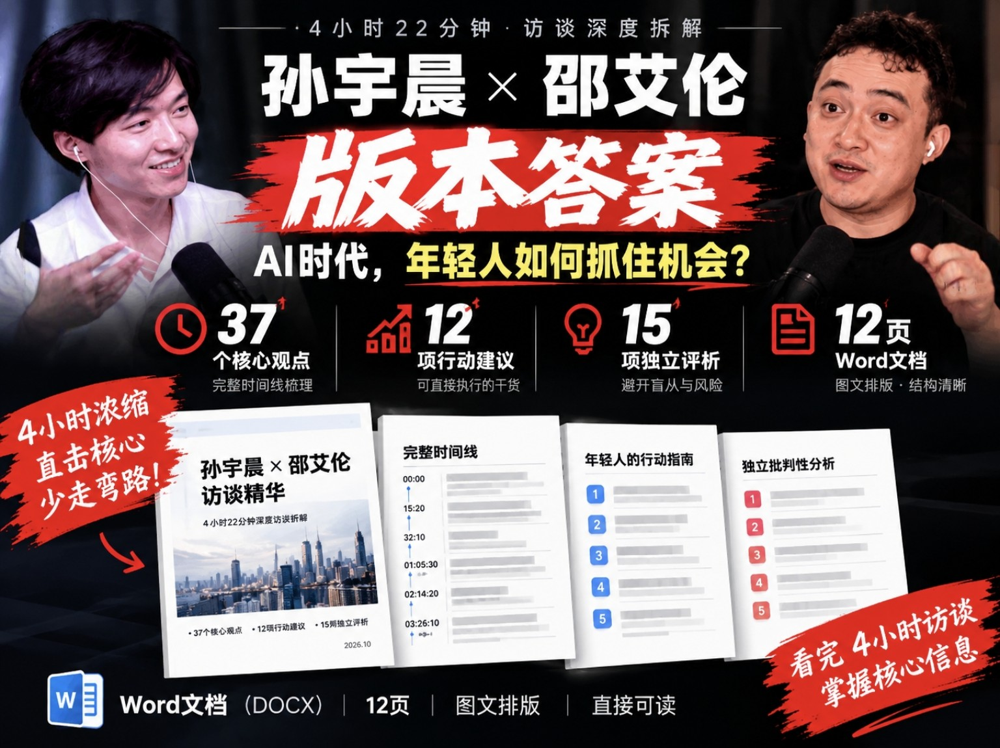

<div align="center">

# 孙宇晨 × 邵艾伦
## AI时代的机会：访谈深度分析

**4小时22分钟访谈 · 核心观点整理 · 行动指南 · 独立批判性分析**



### 📥 获取完整研究报告

[](./SunYuchen_Interview_Analysis.docx)

[📦 下载最新发布版本（Releases）](../../releases/latest)

**DOCX 格式 · 12页 · 中文 · 免费公开**

</div>

---

## 📖 项目简介

2026年，孙宇晨与邵艾伦进行了一场长达4小时22分钟的深度访谈，讨论了AI时代的机遇、创业、个人成长、财富、自由与未来趋势。

本项目对访谈内容进行系统整理，并加入独立分析。

它不只是访谈摘要，更希望回答三个问题：

1. 孙宇晨究竟提出了哪些值得关注的观点？
2. 普通年轻人可以从中提取哪些实际行动建议？
3. 这些观点有哪些适用条件、局限性与潜在风险？

**本项目不提供所谓的“成功标准答案”，而是希望帮助读者建立自己的判断。**

---

## 📊 报告内容

| 模块 | 内容 |
|:---|:---|
| 🕒 访谈时间线 | 37个核心观点，按访谈顺序整理 |
| 🚀 行动指南 | 12项具体行动建议 |
| 🧠 独立评析 | 15项批判性分析 |
| 📅 实践计划 | 90天行动框架 |
| 📄 完整报告 | 12页Word文档 |

---

## 💡 核心议题

### 01 · AI时代的个人机会

AI不仅是一种技术趋势，也可能改变个人获取信息、生产内容和组织工作的方式。

重要的问题不是是否使用AI，而是如何将其转化为实际生产能力。

### 02 · 探索世界与机会发现

通过主动探索不同城市、行业、技术与市场，扩大个人的信息边界。

探索本身可以具有体验价值，也可以成为发现职业和商业机会的方式。

### 03 · 保持选择权

个人发展的重要目标之一，是增加未来的可选择空间。

可迁移技能、信息渠道、现金流和跨地域能力，都可能帮助个人降低对单一路径的依赖。

### 04 · 建立个人信息系统

利用AI与数字工具整理知识、项目、经验和决策记录。

让个人信息能够长期积累、检索、迁移和复用。

### 05 · 从观点走向实践

理解一种商业理念，不等于具备执行它的能力。

真正的认知更新需要现实反馈，包括产品开发、市场验证和实际工作经验。

### 06 · 立场与独立判断

每个人的观点都可能受到自身经历、利益和社会位置的影响。

理解发言者的立场，有助于辨别其观点的适用范围。

**成功者的经验值得研究，但不应直接被视为普遍规律。**

---

## 📥 下载报告

### 方法一：直接下载 Word

**[👉 点击下载完整 Word 报告](./SunYuchen_Interview_Analysis.docx)**

文件名称：

`SunYuchen_Interview_Analysis.docx`

格式：Microsoft Word（DOCX）

### 方法二：通过 Releases 下载

**[👉 前往 Releases 页面](../../releases)**

在最新版本的 Assets 区域下载报告附件。

> 如果尚未发布 Release，请使用上方的 Word 直接下载链接。

---

## 📂 项目文件

```text
Alan-Shao-Justin-Sun-interview-analysis/
│
├── README.md
│
├── SunYuchen_Interview_Analysis.docx
│
└── assets/
    └── cover.jpg
```

---

## ⚠️ 阅读说明

- 本项目为独立整理与研究，不代表访谈嘉宾或相关机构的官方立场。
- 访谈时间戳为近似定位，尚未逐秒核对原始视频。
- 部分观点属于受访者的个人判断，不应直接视为已经验证的事实。
- 涉及投资、创业和职业发展的建议，应结合个人实际情况独立判断。

---

## 📜 版权声明

本项目中的原创整理、分析与评论由整理者独立完成。

原访谈视频、人物肖像、第三方素材及引用内容的版权归相应权利人所有。

本项目的公开发布不代表对第三方版权材料授予使用许可。

---

<div align="center">

### Explore More. Think Independently. Create Value.

**探索世界 · 独立思考 · 创造价值**

如果这份研究对你有所帮助，欢迎 Star ⭐

</div>
